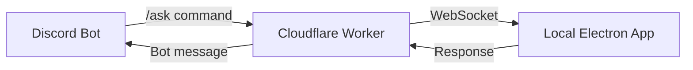

Stellaris Companion is designed with a **privacy-first architecture**. Your save files stay on your machine, and you maintain full control over what data is shared.

## Core privacy principles

<CardGroup cols={2}>
  <Card title="Local processing" icon="laptop">
    All save parsing, extraction, and history tracking happens locally
  </Card>
  <Card title="Your API key" icon="key">
    You provide your own Gemini API key—no shared infrastructure
  </Card>
  <Card title="Opt-in telemetry" icon="toggle-on">
    Issue reports are reviewed before submission
  </Card>
  <Card title="No save file uploads" icon="shield-check">
    Your `.sav` files never leave your machine
  </Card>
</CardGroup>

## What stays local

These components run entirely on your machine:

### Save file processing

- **.sav files** remain on disk at all times
- **Rust parser** (`stellaris-parser`) runs as a local subprocess
- **Extracted game data** is kept in memory during processing
- **SQLite history database** is stored locally (default: `~/.stellaris-companion/history.db`)

### Encryption and storage

- **API keys** are stored in the OS-native secure storage:
  - macOS: Keychain
  - Windows: Credential Manager
  - Linux: Secret Service API (libsecret)
- **Settings and preferences** are stored in local JSON files
- **Discord OAuth tokens** are stored in OS-native secure storage

## What leaves your machine

### To Gemini API (Google)

When you ask a question or request strategic advice:

<Steps>
  <Step title="Extracted game context">
    Structured JSON representation of your game state (military, economy, diplomacy, etc.)
  </Step>
  <Step title="Your question">
    The text of your question or command
  </Step>
  <Step title="Previous messages">
    Recent chat history for conversation context (last ~10 messages)
  </Step>
  <Step title="System prompt">
    Instructions that define your empire's advisor personality
  </Step>
</Steps>

<Warning>
Your save file binary is **never** sent to Gemini. Only the extracted, structured game data goes to the API.
</Warning>

### Example data sent to Gemini

Here's what a typical request looks like:

```json
{
  "empire": {
    "name": "United Nations of Earth",
    "government": "Democratic Crusaders",
    "ethics": ["Egalitarian", "Xenophile", "Materialist"]
  },
  "military": {
    "total_fleet_power": 125000,
    "fleet_cap": 500,
    "fleet_cap_usage": 450
  },
  "economy": {
    "energy": 2500,
    "minerals": 1800,
    "alloys": 450
  },
  "question": "Should I attack the fallen empire?"
}
```

Notice:
- No player names or Steam IDs
- No file paths
- No system information
- Only in-game strategic data

### To Discord relay (optional)

If you enable the Discord integration:

- **Questions** sent via `/ask` are forwarded to your local app
- **Responses** from your local app are sent back through the relay
- **No save data** is stored on the relay server
- **WebSocket connection** is authenticated with your Discord token

The relay is a Cloudflare Worker that acts as a bridge:



<Note>
The relay only forwards messages—it does not store save data or API responses. Connection state is ephemeral.
</Note>

### Issue reports (opt-in)

When you submit an issue report through the in-app feedback modal:

<AccordionGroup>
  <Accordion title="Always included">
    - App version
    - Platform (Windows/macOS/Linux)
    - Electron version
    - Your category selection (bug, feature request, etc.)
    - Your description text
  </Accordion>
  
  <Accordion title="Optional toggles (you review before submit)">
    - **Game diagnostics**: Save metadata, DLC count, empire identity
    - **Backend log tail**: Last ~32KB of backend logs
    - **Screenshot**: Temporary image upload URL
    - **Error stack**: Exception traceback if available
    - **LLM context**: Last prompt and response (for AI-related bugs)
  </Accordion>
</AccordionGroup>

From `docs/feedback-reporting.md:15`:

<Info>
All optional fields are presented with clear toggles in the UI. You review exactly what will be submitted before confirming.
</Info>

## Security architecture

### Backend authentication

The Python backend uses a Bearer token (`STELLARIS_API_TOKEN`) for authentication:

- **Token generation**: Electron main generates a random token on first launch
- **Token storage**: Stored in OS-native secure storage (never in plain text)
- **Token usage**: Attached to all HTTP requests from main to backend
- **Renderer isolation**: The renderer process **never** receives the token

From `docs/architecture.md:20`:

```
Security boundaries:
- The backend uses a Bearer token (STELLARIS_API_TOKEN) for all HTTP requests
- Electron main generates/holds the token and attaches it to backend requests
- The renderer never sees the token (context isolation + preload bridge only)
```

### Context isolation

Electron's context isolation ensures the renderer can't access Node.js APIs directly:

```javascript electron/preload.js
const { contextBridge, ipcRenderer } = require('electron')

contextBridge.exposeInMainWorld('electronAPI', {
  backend: {
    chat: (args) => ipcRenderer.invoke('backend:chat', args),
    loadSave: (args) => ipcRenderer.invoke('backend:load-save', args),
    // ... safe IPC methods only
  }
})
```

The renderer can only call whitelisted IPC methods—no direct file system or subprocess access.

## Data retention

### Local history database

The SQLite database (`stellaris_history.db`) stores:

- **Save snapshots**: Extracted game state at different points in time
- **Chronicle chapters**: Generated narrative history
- **Chat history**: Your questions and the AI's responses

You can delete this database at any time:

```bash
rm ~/.stellaris-companion/history.db
```

### Gemini API retention

Google's data retention policy for Gemini API:

- Prompts and responses may be retained for service improvement
- You can review [Google's AI Services Privacy Notice](https://policies.google.com/privacy)
- Using your own API key means Google can't cross-reference your data with other users

<Warning>
If you're concerned about data retention, avoid sending sensitive campaign details in your questions. The AI works well with high-level strategic queries.
</Warning>

## Discord integration privacy

When you connect Discord:

### OAuth flow

From `docs/architecture.md:45`:

- **OAuth/PKCE**: Industry-standard secure authorization flow
- **Token storage**: Discord access token stored in OS-native secure storage
- **Scopes**: Only requests `identify` and `guilds` permissions
- **Refresh tokens**: Handled automatically by the main process

### Relay communication

The Cloudflare Worker relay:

- **Does not store** save data or game state
- **Does not log** conversation content
- **Only forwards** messages between Discord and your local app
- **Requires authentication** via Discord token (can't be accessed by others)

### Self-hosting

For maximum privacy, you can self-host the relay:

<Info>
See `cloudflare/README.md` in the source repository for relay self-hosting instructions.
</Info>

## Network traffic summary

Complete list of network connections:

| Destination | Purpose | Frequency |
|-------------|---------|----------|
| `generativelanguage.googleapis.com` | Gemini API calls | Per chat message |
| `discord.com/api` | Discord OAuth + bot API | On Discord connect + message send |
| Cloudflare Worker URL | Discord relay WebSocket | Persistent connection when Discord enabled |
| `github.com` | Check for app updates | Once per launch |
| `raw.githubusercontent.com` | Download announcements.json | Once per launch |

<Note>
No telemetry, analytics, or crash reporting services are contacted by default. All network activity is related to core features you explicitly use.
</Note>

## Threat model considerations

### What this architecture protects against

<AccordionGroup>
  <Accordion title="Server-side data breaches">
    No centralized database means no server to breach. Your save data is only on your machine.
  </Accordion>
  
  <Accordion title="Unauthorized API access">
    You control the API key. No shared credentials means no unauthorized access to your data.
  </Accordion>
  
  <Accordion title="Renderer compromise">
    Context isolation prevents malicious renderer code from accessing the backend token or file system.
  </Accordion>
</AccordionGroup>

### What this architecture does NOT protect against

<AccordionGroup>
  <Accordion title="Malware on your machine">
    If your system is compromised, malware could read your save files or database directly.
  </Accordion>
  
  <Accordion title="Google/Discord data retention">
    Data sent to third-party APIs (Gemini, Discord) is subject to their privacy policies.
  </Accordion>
  
  <Accordion title="Shoulder surfing">
    The app does not encrypt the UI or prevent screen recording.
  </Accordion>
</AccordionGroup>

## Best practices for privacy

<Steps>
  <Step title="Use restrictive API key settings">
    Configure your Gemini API key with IP restrictions and usage quotas in [AI Studio](https://aistudio.google.com/)
  </Step>
  
  <Step title="Review before reporting issues">
    Always review the optional fields before submitting issue reports
  </Step>
  
  <Step title="Self-host the relay (optional)">
    Deploy your own Cloudflare Worker for Discord integration
  </Step>
  
  <Step title="Keep backups">
    Your history database contains your campaign narrative—back it up regularly
  </Step>
  
  <Step title="Rotate API keys periodically">
    Regenerate your Gemini API key every few months as a precaution
  </Step>
</Steps>

## Comparison to cloud-based tools

How Stellaris Companion differs from typical SaaS game assistants:

| Feature | Stellaris Companion | Typical SaaS Tool |
|---------|---------------------|-------------------|
| Save file location | Your machine only | Uploaded to server |
| API key | Your own key | Shared/pooled keys |
| Data processing | Local Rust parser | Server-side |
| History storage | Local SQLite | Cloud database |
| Network dependency | Only for LLM calls | Required for all features |
| Data breach risk | Low (no central DB) | High (central server) |

## Open source transparency

The entire codebase is open source under the MIT license:

- **Review the code**: [github.com/gitmaan/stellaris-companion](https://github.com/gitmaan/stellaris-companion)
- **Audit network calls**: All HTTP/WebSocket traffic is visible in the source
- **Verify claims**: Check `electron/main/backendClient.js` for token handling
- **Build from source**: Compile the app yourself if you want full control

No obfuscation, no hidden telemetry, no proprietary backend services.

## Questions and concerns

If you have privacy questions or concerns:

- Open an issue: [github.com/gitmaan/stellaris-companion/issues](https://github.com/gitmaan/stellaris-companion/issues)
- Review the architecture: [Architecture overview](/advanced/architecture)
- Check the code: All privacy-sensitive code is in the public repo

<Info>
The maintainers take privacy seriously. If you discover a privacy issue, please report it responsibly via GitHub issues.
</Info>
